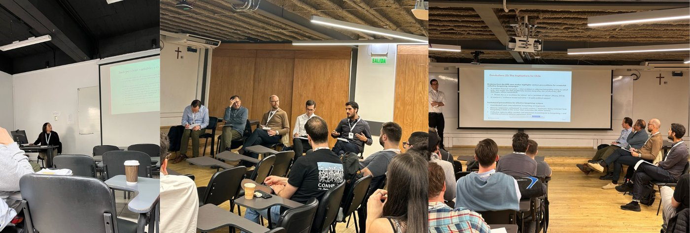

{.post-cover}

## 43ª ILPC
Con la participación de más de 250 académicos e investigadores se celebró la 43ª [International Labour Process Conference](https://www.ilpc.org.uk/) en Santiago, Chile. El escenario fue la [Universidad Alberto Hurtado](https://www.uahurtado.cl/).

## Ponencia
Con la presentación **"Labor unions, workplace democracy, and political spillovers in liberalmarket economies: an empirical analysis of the Chilean case"**, [Pablo Pérez Ahumada](../../../nosotros/miembros/perez.qmd) y [Daniela Olivares Collío](../../../nosotros/miembros/olivares.qmd), mostraron los primeros resultados del proyecto utilizando la base de datos de la Encuesta Conclat Chile 2024.

## Simposio
También, [Pablo Pérez Ahumada](../../../nosotros/miembros/perez.qmd) participó como discussant del Simposio **"The Revival of Multi-Employer Collective Bargaining. Prospects for Chile"**. 

  <a class="btn btn-sm btn-primary" href="https://heyzine.com/flip-book/5dd1a3e6c9.html#page/1" target="_blank" rel="noopener">Ver programa</a>

