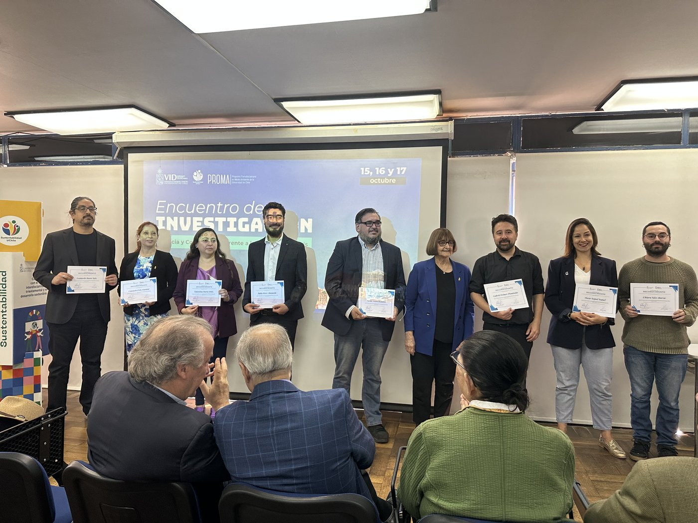

{.post-cover}

## Encuentro de Investigación U. de Chile 2025
El pasado miércoles 15, jueves 16 y viernes 17 de octubre se realizó el [Encuentro de Investigación 2025: Ciencia y Conocimiento frente a los desafíos país](https://uchile.cl/agenda/231109/encuentro-de-investigacion-uchile-2025), de la [Universidad de Chile](https://uchile.cl/). Este espacio convocó a académicos/as, estudiantes e investigadores/as de la universidad a reflexionar en torno a la investigación desarrollada. La instancia contempló la exposición de charlas magistrales, poster académicos/as, talleres y participación de distintas instancias universitarias. 

## Ceremonia de Premiación
En dicha instancia se realizó la ceremonia de reconocimiento a distintos/as investigadores/as por su aporte al desarrollo de la investigación. [**Pablo Pérez Ahumada**](../../../nosotros/miembros/perez.qmd), Investigador Principal del [Proyecto Conclat](../../../index.qmd) y académico de la [Facultad de Ciencias Sociales](https://facso.uchile.cl/), recibió un importante reconocimiento por su labor y aporte a la investigación en la categoría **Resolución de los Problemas País**. 

  <a class="btn btn-sm btn-primary" href="https://facso.uchile.cl/noticias/233858/academicos-de-facso-fueron-premiados-en-encuentro-de-investigacion" target="_blank" rel="noopener">Leer más</a>

