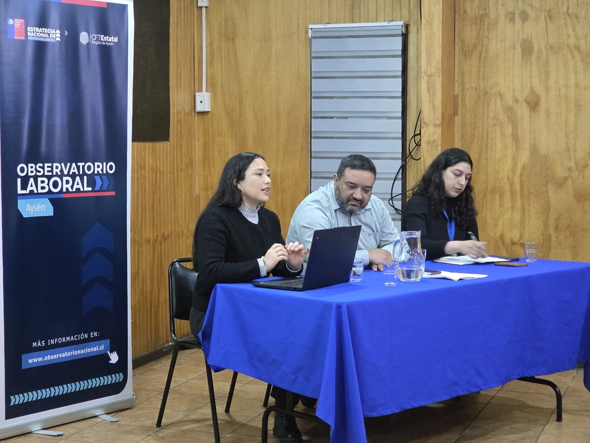

{.post-cover}

## Taller de Formación Sindical
El pasado miércoles 22 de octubre participamos en el Taller de Formación: Prospectiva Laboral y Desafíos del Empleo Regional, organizado por el [Observatorio Laboral de Aysén](https://www.subtrab.gob.cl/division-politicas-de-empleo/prospeccion-laboral/pol/) en conjunto con la Dirección del Trabajo y el Servicio Nacional de la Mujer y Equidad de género. 

En esta oportunidad, [**Daniela Olivares Collío**](../../../nosotros/miembros/olivares.qmd), asistente de investigación de Conclat, presentó resultados de nuestra investigación, que fueron comentados por el Seremi de Economía, Fomento y Turismo, Felipe Rojas Pizarro. 

Esta instancia contó con la participación del director de Sence Nelson Garrido, Seremi del Trabajo Rodrigo Díaz, el presidente del sindicato Friosur Rubén Leal, y académicos y académicas de la [Universidad de Aysén](https://uaysen.cl/) y del [Centro de Formación Técnica de Aysén](https://cftestataldeaysen.cl/).
