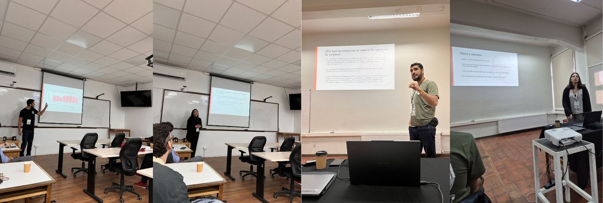

{.post-cover}

## Primer Congreso Chileno de Estudios del Trabajo
La iniciativa impulsada por la [Asociación Chilena de Estudios del Trabajo](https://acetchile.cl/index.php) reunió a más de 100 personas del mundo académico, sindical y político a reflexionar en torno a los nuevos escenarios del trabajo en América Latina. El evento se desarrolló el 9, 10 y 11 de abril en la [Universidad Austral de Chile](https://www.uach.cl/) y contó con numerosas ponencias, simposios, exposiciones fotográficas y presentaciones de pósters y libros.

## Ponencia “Clases sociales, movimientos sindicales y conflicto en tiempos de crisis: un estudio comparativo de Argentina y Chile”
Durante la jornada del 09 de abril, se presentó la ponencia **“Clases sociales, movimientos sindicales y conflicto en tiempos de crisis: un estudio comparativo de Argentina y Chile”**, a cargo de [Pablo Pérez Ahumada](../../../nosotros/miembros/perez.qmd) y [Daniela Olivares Collío](../../../nosotros/miembros/olivares.qmd). En la instancia, se dieron a conocer avances de la encuesta desarrollada en el marco del [Proyecto Conclat](../../../index.qmd), destacando su aporte para analizar dimensiones como la posición y conciencia de clase, así como la percepción de explotación.

## Ponencia “Conflicto laboral, recursos de poder y afiliación a asociaciones empresariales: evidencia desde Chile en perspectiva comparada”
Asimismo, el sábado 11 de abril, [Pablo Pérez Ahumada](../../../nosotros/miembros/perez.qmd) y [Javiera Romo Sánchez](../../../nosotros/miembros/romo.qmd) expusieron la investigación **“Conflicto laboral, recursos de poder y afiliación a asociaciones empresariales: evidencia desde Chile en perspectiva comparada”**. El estudio, basado en datos de la [X Encuesta Laboral (ENCLA)](https://www.ine.gob.cl/encla), evidenció que el poder de los trabajadores incide en la coordinación empresarial, particularmente en aquellas empresas más expuestas a conflictos laborales.

  <a class="btn btn-sm btn-primary" href="https://drive.google.com/file/d/1VrQSj6-s5guCl1FMDyRhnC_u_Ix0leQe/view" target="_blank" rel="noopener">Ver programa</a>

