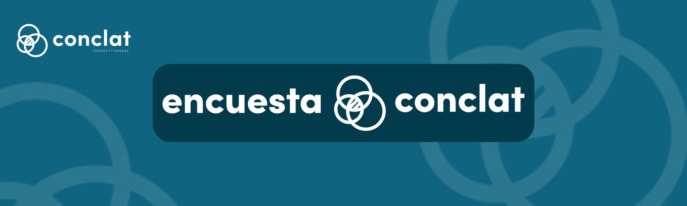

```{=html}
<!-- ========== 1. BANNER ========== -->
<div class="banner-encuesta full-bleed">

</div>
```

```{=html}
<!-- ========== 2. CIFRAS ========== -->
<div class="section full-bleed">
<div class="inner survey-intro">
<p class="survey-download"><a class="btn btn-teal btn-lg" href="https://dataverse.harvard.edu/dataset.xhtml?persistentId=doi:10.7910/DVN/URQRDQ" target="_blank" rel="noopener"><i class="bi bi-download"></i> Descargar base de datos</a></p>
<div class="section-head teal">
<h2>Sobre la encuesta</h2>
</div>
<div class="survey-facts">
<div class="fact"><strong>3.048</strong><span>personas trabajadoras encuestadas en Chile, en las 15 regiones del país</span></div>
<div class="fact"><strong>1.698</strong><span>personas trabajadoras encuestadas en Argentina, en las seis regiones geográficas</span></div>
<div class="fact"><strong>3 módulos</strong><span>de preguntas: clase social, trabajo y percepciones político-económicas</span></div>
</div>
<p class="survey-text">La encuesta forma parte del proyecto Fondecyt Regular N° 1230056 (2023-2027). Busca contribuir al estudio de las clases sociales y del conflicto laboral y político, a partir de esquemas teóricamente fundamentados como el neomarxista de Erik Olin Wright. El diseño muestral permite obtener información representativa de la población nacional urbana ocupada, es decir, de quienes estaban trabajando en un empleo remunerado al momento de la encuesta.</p>
</div>
</div>
```

```{=html}
<!-- ========== 3. MÓDULOS ========== -->
<div class="section section-tint full-bleed">
<div class="section-head">
<span class="kicker">El cuestionario</span>
<h2>Tres módulos de preguntas</h2>
</div>
<div class="study-grid">
<div class="study-card">
<i class="bi bi-person-vcard-fill"></i>
<h3>Clase social</h3>
<p>Antecedentes demográficos y posición de clase de cada persona encuestada.</p>
</div>
<div class="study-card">
<i class="bi bi-briefcase-fill"></i>
<h3>Trabajo</h3>
<p>Relaciones laborales y condiciones de empleo.</p>
</div>
<div class="study-card">
<i class="bi bi-chat-square-text-fill"></i>
<h3>Percepciones</h3>
<p>Opiniones sobre la situación político-económica actual.</p>
</div>
</div>
</div>
```

```{=html}
<!-- ========== 4. FECHAS Y LUGARES ========== -->
<div class="section full-bleed">
<div class="section-head teal">
<span class="kicker">Trabajo de campo</span>
<h2>Fechas y lugares de aplicación</h2>
</div>
<div class="compare-grid">
<div class="compare-card teal">
<span class="compare-figure country">Chile</span>
<p class="compare-detail"><strong>3.048 personas</strong> · 19 nov. 2024 al 20 ene. 2025</p>
<p class="compare-detail">Residentes en las 15 regiones del país.</p>
</div>
<div class="compare-card teal">
<span class="compare-figure country">Argentina</span>
<p class="compare-detail"><strong>1.698 personas</strong> · abril a agosto de 2025</p>
<p class="compare-detail">Ciudad de Buenos Aires, conurbano bonaerense y otras ciudades de las seis regiones: Área Metropolitana de Buenos Aires, Centro, NOA/Cuyo, Pampeana, Nordeste y Patagonia.</p>
</div>
</div>
</div>
```

```{=html}
<!-- ========== 5. OBJETIVOS ========== -->
<div class="section section-tint full-bleed">
<div class="section-head">
<span class="kicker">Qué buscamos</span>
<h2>Objetivos</h2>
</div>
<div class="inner survey-intro">
<p class="survey-text">Comprender cómo la clase social y la afiliación sindical influyen en dos tipos de conflicto.</p>
</div>
<div class="study-grid study-grid-2">
<div class="study-card">
<i class="bi bi-people-fill"></i>
<h3>Conflicto social</h3>
<p>Percepción de tensiones en el trabajo (por ejemplo, entre empresarios y trabajadores) y atribución de responsabilidad por problemas como el desempleo y la inflación.</p>
</div>
<div class="study-card">
<i class="bi bi-bank2"></i>
<h3>Conflicto político</h3>
<p>Actitudes hacia políticas redistributivas, la extensión de derechos laborales y el rol del Estado.</p>
</div>
</div>
<div class="inner survey-intro">
<p class="survey-text">Además, examinamos la relación entre ambos y cómo varía entre Chile y Argentina, y entre sectores económicos según su nivel de organización sindical. Para más información, revisa <a href="../informacion/01-sobre.html">Sobre Conclat</a>.</p>
</div>
</div>
```

```{=html}
<!-- ========== 6. ACCESO A LOS DATOS ========== -->
<div class="section full-bleed">
<div class="section-head teal">
<span class="kicker">Datos abiertos</span>
<h2>Acceso y uso de los datos</h2>
</div>
<div class="inner survey-intro">
<p class="survey-text">La base de datos, el cuestionario y el libro de códigos están disponibles en Harvard Dataverse. Por ahora solo está publicada la base chilena; la argentina se publicará próximamente.</p>
</div>
<div class="study-grid study-grid-2">
<div class="study-card teal">
<i class="bi bi-journal-text"></i>
<h3>Manual Metodológico</h3>
<p>Describe el diseño del estudio, la construcción de la muestra, el trabajo de campo y los procedimientos de codificación y validación aplicados en Chile y Argentina.</p>
</div>
<div class="study-card teal">
<i class="bi bi-book-fill"></i>
<h3>Libro de Códigos</h3>
<p>Detalla todas las variables de la base: etiquetas, valores posibles, restricciones y notas de codificación.</p>
</div>
</div>
<div class="inner survey-intro">
<p class="survey-text">Antes de trabajar con los datos, recomendamos revisar ambos documentos en conjunto.</p>
<p style="text-align:center"><a class="btn btn-teal btn-lg" href="https://dataverse.harvard.edu/dataset.xhtml?persistentId=doi:10.7910/DVN/URQRDQ" target="_blank" rel="noopener"><i class="bi bi-download"></i> Descargar base de datos</a></p>
</div>
</div>
```

```{=html}
<!-- ========== 7. CÓMO CITAR ========== -->
<div class="section section-tint full-bleed">
<div class="section-head">
<span class="kicker">Referencias</span>
<h2>Cómo citar</h2>
</div>
<div class="inner cite-wrap">
<div class="cite-box">
<h3>Para citar los datos</h3>
<p>Pérez Ahumada, Pablo. (2026). <em>Classes, Work and Conflict Survey (CONCLAT): Chile and Argentina 2025</em>. Harvard Dataverse, V1. <a href="https://doi.org/10.7910/DVN/URQRDQ" target="_blank" rel="noopener">https://doi.org/10.7910/DVN/URQRDQ</a></p>
</div>
<div class="cite-box">
<h3>Para citar el manual metodológico</h3>
<p>Pérez Ahumada, P., Olivares Collío, D., Romo Sánchez, J. (2026). <em>Manual Metodológico Classes, Work and Conflict Survey (CONCLAT): Chile and Argentina 2025.</em></p>
</div>
</div>
</div>
```

```{=html}
<!-- ========== 8. INSTITUCIONES ========== -->
<div class="logos-strip full-bleed">
<div class="logos">
<a href="https://anid.cl"></a>
<a href="https://uchile.cl"></a>
</div>
</div>
```
