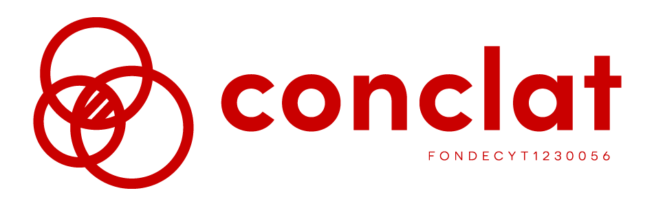
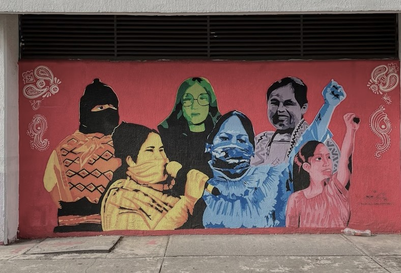
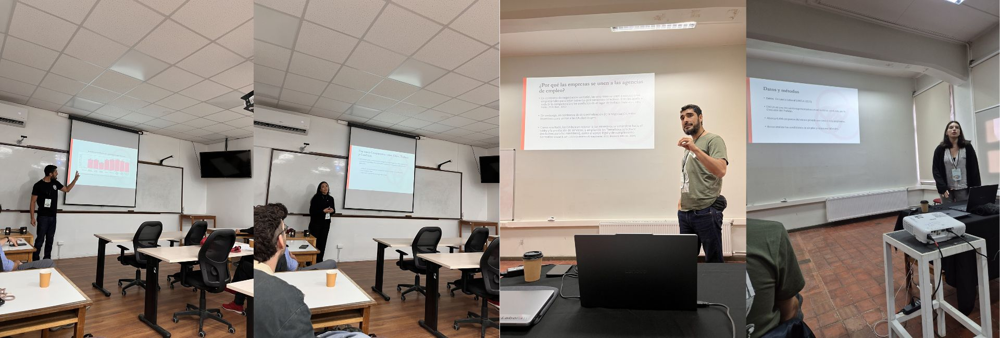

```{=html}
<!-- ========== 1. HERO: logo + frase corta ========== -->
<div class="hero-home hero-particles full-bleed">
<div id="particles-js" class="particles-layer" aria-hidden="true"></div>
<div class="hero-heading-content">

<p class="hero-tagline">
    Clases sociales, movimientos sindicales y conflicto en tiempos de crisis: un estudio comparativo de Argentina y Chile
</p>
</div>
</div>
```

```{=html}
<!-- ========== 2. NOVEDADES ========== -->
<div class="section section-alt full-bleed">
<div class="section-head">
<span class="kicker">Novedades</span>
<h2>Lo más reciente</h2>
</div>
<div class="news-grid">

<a class="news-card news-teal" href=encuesta/encuesta.html>
<div class="news-cover">
<span class="news-cover-title">encuesta<br>conclat’24</span>
</div>
<div class="news-body">
<span class="news-tag">Datos abiertos</span>
<h3>La Encuesta CONCLAT ya está abierta</h3>
<p>La base de datos, el cuestionario y el libro de códigos de Chile están disponibles en Harvard Dataverse. La base de Argentina se publicará próximamente.</p>
<span class="go">Descargar los datos →</span>
</div>
</a>

<a class="news-card" href="investigacion/investigacion.html">
<div class="news-cover"></div>
<div class="news-body">
<span class="news-tag">Publicación · 26 ago 2026</span>
<h3>Los efectos igualadores de género de los sindicatos</h3>
<p>La afiliación sindical y las brechas de género en la participación política en América Latina. Pablo Pérez Ahumada y Patricia Retamal.</p>
<span class="go">Ver investigación →</span>
</div>
</a>

<a class="news-card" href="actividades/actividades.html">
<div class="news-cover"></div>
<div class="news-body">
<span class="news-tag">Actividad · 11 abr 2026</span>
<h3>Ponencias en el Primer Congreso Chileno de Estudios del Trabajo</h3>
<p>Presentamos dos ponencias y un póster en el Pre-ALAST 2026, “Los nuevos escenarios del trabajo en América Latina”.</p>
<span class="go">Ver actividades →</span>
</div>
</a>

</div>
</div>
```

```{=html}
<!-- ========== 3. EXPLORA ========== -->
<div class="section full-bleed">
<div class="section-head">
<span class="kicker">Explora</span>
<h2>Conoce el proyecto</h2>
</div>
<div class="explore-grid">
<a class="explore-card" href="informacion/01-sobre.html">
<i class="bi bi-info-circle-fill"></i><h3>Sobre CONCLAT</h3>
<p>Detalles del proyecto.</p><span class="go">Ver más →</span>
</a>
<a class="explore-card" href="nosotros/nosotros.html">
<i class="bi bi-people-fill"></i><h3>Equipo</h3>
<p>Quiénes somos.</p><span class="go">Ver más →</span>
</a>
<a class="explore-card teal" href="encuesta/index.html">
<i class="bi bi-bar-chart-fill"></i><h3>Encuesta Conclat</h3>
<p>Descarga la base de datos y la documentación.</p><span class="go">Ver más →</span>
</a>
<a class="explore-card" href="investigacion/investigacion.html">
<i class="bi bi-journal-text"></i><h3>Investigación</h3>
<p>Papers publicados.</p><span class="go">Ver más →</span>
</a>
<a class="explore-card" href="prensa/prensa.html">
<i class="bi bi-newspaper"></i><h3>Prensa</h3>
<p>Columnas y apariciones en medios.</p><span class="go">Ver más →</span>
</a>
<a class="explore-card" href="actividades/actividades.html">
<i class="bi bi-calendar-event"></i><h3>Actividades</h3>
<p>Congresos, seminarios y ponencias.</p><span class="go">Ver más →</span>
</a>
</div>
</div>
```

```{=html}
<!-- ========== 4. BANDA "SOBRE CONCLAT" ========== -->
<div class="image-band full-bleed">
<div class="inner">
<h2>Sobre Conclat</h2>
<p>
      El Proyecto Conclat busca estudiar cómo se percibe el conflicto laboral y político
      en Argentina y Chile. Analiza cómo las personas de distintas clases sociales y con
      distinto estatus sindical (afiliados/as y no afiliados/as a sindicatos) perciben el
      conflicto dentro y fuera del lugar de trabajo. Para ello se aplicó una encuesta
      representativa de la población ocupada en ambos países, con el propósito de producir
      datos cuantitativos originales y un instrumento comparable a nivel internacional.
</p>
</div>
</div>
```

```{=html}
<!-- ========== 5. LOGOS ========== -->
<div class="logos-strip full-bleed">
<div class="logos">
<a href="https://anid.cl"></a>
<a href="https://uchile.cl"></a>
</div>
</div>
```
