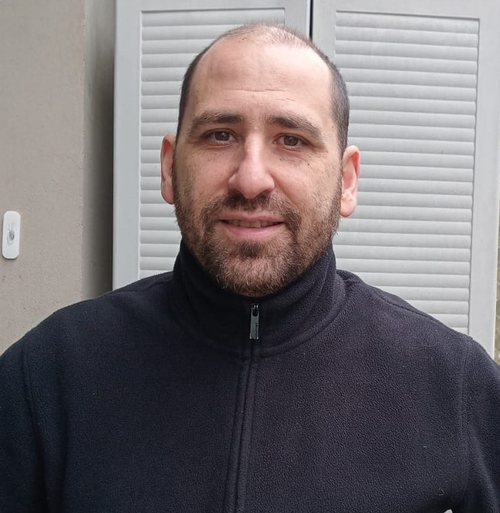

```{=html}
<div class="page-hero full-bleed">
<div class="page-hero-inner">
<h1 class="page-title">Rodolfo Elbert</h1>
</div>
</div>
```

```{=html}
<div class="section full-bleed">
<div class="profile">
<div class="profile-side">

<span class="team-role">Investigador</span>
<div class="card-contacto"><a href="mailto:elbert.rodolfo@gmail.com" aria-label="Correo" title="Correo"><i class="bi bi-envelope-fill"></i></a><a href="https://www.conicet.gov.ar/new_scp/detalle.php?id=35394&amp;datos_academicos=yes" target="_blank" rel="noopener" aria-label="Web" title="Web"><i class="bi bi-globe"></i></a></div>
</div>
<div class="profile-body">
<p>Coordinador del Trabajo de campo en Argentina.</p>
<p>Doctor en Sociología (Universidad de Wisconsin-Madison) y Mg. en Investigación en Ciencias Sociales y Lic. en Sociología por la Universidad de Buenos Aires.</p>
<p>Actualmente es Investigador Adjunto en el Consejo Nacional de Investigaciones Científicas y Técnicas (CONICET) con sede en el Instituto de Investigaciones Gino Germani (Universidad de Buenos Aires), donde co-dirige el Programa de Investigaciones sobre Análisis de Clases Sociales (PI-Clases). Es Profesor Adjunto en la Carrera de Sociología de la Universidad de Buenos Aires y dicta clases en la Maestría en Investigación en Ciencias Sociales (UBA).</p>
<a class="profile-back" href="../nosotros.html">&larr; Volver al equipo</a>
</div>
</div>
</div>
```
