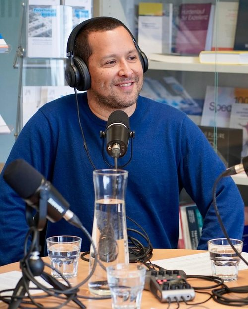

```{=html}
<div class="page-hero full-bleed">
<div class="page-hero-inner">
<h1 class="page-title">Juan Diego García-Castro</h1>
</div>
</div>
```

```{=html}
<div class="section full-bleed">
<div class="profile">
<div class="profile-side">

<span class="team-role">Investigador</span>
<div class="card-contacto"><a href="mailto:juandiego.garcia@ucr.ac.cr" aria-label="Correo" title="Correo"><i class="bi bi-envelope-fill"></i></a><a class="txt" href="https://scholar.google.com/citations?user=o_ReskMAAAAJ&amp;hl=es" target="_blank" rel="noopener" aria-label="Google Scholar" title="Google Scholar">GS</a><a class="txt" href="https://www.researchgate.net/profile/Juan-Garcia-Castro-2" target="_blank" rel="noopener" aria-label="ResearchGate" title="ResearchGate">RG</a><a href="https://bsky.app/profile/juandiego48cr.bsky.social" target="_blank" rel="noopener" aria-label="Bluesky" title="Bluesky"><i class="bi bi-bluesky"></i></a></div>
</div>
<div class="profile-body">
<p>Doctor en Psicología Social y con maestría en Psicología de la Intervención Social de la Universidad de Granada, España. Obtuvo su bachillerato y licenciatura en Psicología en la Universidad de Costa Rica. Realizó un postdoctorado en el Centro de Estudios de Conflicto y Cohesión Social (COES), Chile.</p>
<p>Actualmente es profesor catedrático de la Universidad de Costa Rica (Sede de Occidente). Su línea de investigación se centra en el estudio de la psicología social de la desigualdad económica, violencia, justicia distributiva, ideología y Centroamérica.</p>
<a class="profile-back" href="../nosotros.html">&larr; Volver al equipo</a>
</div>
</div>
</div>
```
