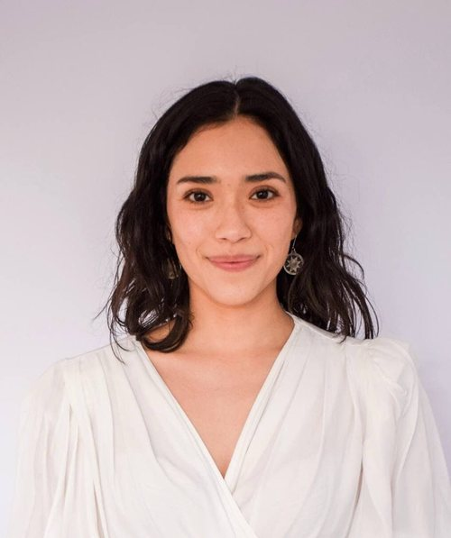

```{=html}
<div class="page-hero full-bleed">
<div class="page-hero-inner">
<h1 class="page-title">Daniela Olivares Collío</h1>
</div>
</div>
```

```{=html}
<div class="section full-bleed">
<div class="profile">
<div class="profile-side">

<span class="team-role">Asistente de Investigación</span>
<div class="card-contacto"><a href="mailto:danielaolivarescollio@gmail.com" aria-label="Correo" title="Correo"><i class="bi bi-envelope-fill"></i></a><a href="https://www.linkedin.com/in/daniela-olivares-collio/" target="_blank" rel="noopener" aria-label="LinkedIn" title="LinkedIn"><i class="bi bi-linkedin"></i></a><a href="https://github.com/DaniOlivaresCollio" target="_blank" rel="noopener" aria-label="GitHub" title="GitHub"><i class="bi bi-github"></i></a><a class="txt" href="https://orcid.org/0009-0009-4783-4030" target="_blank" rel="noopener" aria-label="ORCID" title="ORCID">iD</a></div>
</div>
<div class="profile-body">
<p>Magíster en Estadística de la Pontificia Universidad Católica de Chile y Licenciada en Sociología de la Universidad de Chile.</p>
<p>Actualmente es asistente de investigación del Proyecto Fondecyt Regular N° 1230056 “Clases sociales, movimientos sindicales y conflicto en tiempos de crisis: un estudio comparativo de Argentina y Chile” (Conclat). Y también es asistente de investigación del Núcleo Milenio en Política Laboral y Vida Familiar y Colectiva (LABOFAM).</p>
<p>Anteriormente, ha participado en diversas investigaciones elaborando cuestionarios, procesando y analizando datos y generando informes. También coordinó el Estudio Longitudinal Social de Chile (ELSOC) del Centro de Estudios de Conflicto y Cohesión Social (COES).</p>
<a class="profile-back" href="../nosotros.html">&larr; Volver al equipo</a>
</div>
</div>
</div>
```
