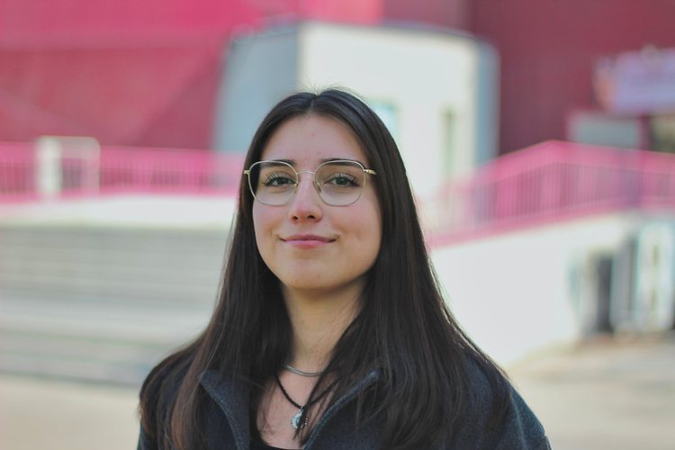

```{=html}
<div class="page-hero full-bleed">
<div class="page-hero-inner">
<h1 class="page-title">Javiera Romo Sánchez</h1>
</div>
</div>
```

```{=html}
<div class="section full-bleed">
<div class="profile">
<div class="profile-side">

<span class="team-role">Asistente de Investigación</span>
<div class="card-contacto"><a href="mailto:javiera.romo.s@uchile.cl" aria-label="Correo" title="Correo"><i class="bi bi-envelope-fill"></i></a><a href="https://www.linkedin.com/in/javiera-romo-s%C3%A1nchez-b6334a371/" target="_blank" rel="noopener" aria-label="LinkedIn" title="LinkedIn"><i class="bi bi-linkedin"></i></a><a href="https://github.com/JaviRomoS" target="_blank" rel="noopener" aria-label="GitHub" title="GitHub"><i class="bi bi-github"></i></a></div>
</div>
<div class="profile-body">
<p>Socióloga de la Universidad de Chile.</p>
<p>Es asistente de investigación en el proyecto Fondecyt Regular N° 1230056 “Clases sociales, movimientos sindicales y conflicto en tiempos de crisis: un estudio comparativo en Argentina y Chile” (Conclat). Anteriormente ha trabajado en diversos  proyectos de investigación, incluyendo el Núcleo Milenio en Política laboral y Vida Familiar y Colectiva (LABOFAM).</p>
<a class="profile-back" href="../nosotros.html">&larr; Volver al equipo</a>
</div>
</div>
</div>
```
