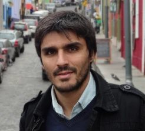
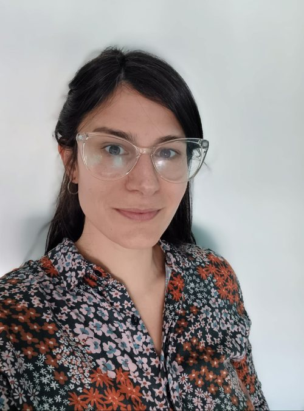

```{=html}
<!-- ========== ENCABEZADO DE PÁGINA ========== -->
<div class="page-hero full-bleed">
<div class="page-hero-inner">
<h1 class="page-title">Nuestro equipo</h1>
</div>
</div>
```

```{=html}
<!-- ========== INVESTIGADOR PRINCIPAL ========== -->
<div class="section full-bleed">
<div class="section-head">
<span class="kicker">Dirección del proyecto</span>
<h2>Investigador principal</h2>
</div>
<div class="team-grid team-grid-2">
<article class="team-card">
<a class="team-link" href="miembros/perez.html">

<h3>Pablo Pérez Ahumada</h3>
</a>
<span class="team-role">Investigador Principal</span>
<div class="card-contacto"><a href="mailto:pabloperez@uchile.cl" aria-label="Correo" title="Correo"><i class="bi bi-envelope-fill"></i></a><a href="https://pperezahumada.com/" target="_blank" rel="noopener" aria-label="Web" title="Web"><i class="bi bi-globe"></i></a><a class="txt" href="https://orcid.org/0000-0002-0410-0725" target="_blank" rel="noopener" aria-label="ORCID" title="ORCID">iD</a><a href="https://x.com/pablo_perez_a" target="_blank" rel="noopener" aria-label="X" title="X"><i class="bi bi-twitter-x"></i></a></div>
<a class="team-more" href="miembros/perez.html">Ver perfil &rarr;</a>
</article>
</div>
</div>
```

```{=html}
<!-- ========== INVESTIGADORES E INVESTIGADORAS ========== -->
<div class="section section-alt full-bleed">
<div class="section-head">
<span class="kicker">Investigación</span>
<h2>Investigadores e investigadoras</h2>
</div>
<div class="team-grid">
<article class="team-card">
<a class="team-link" href="miembros/gutierrez.html">

<h3>Francisca Gutiérrez</h3>
</a>
<span class="team-role">Co-Investigadora</span>
<div class="card-contacto"><a href="mailto:francisca.gutierrez@uach.cl" aria-label="Correo" title="Correo"><i class="bi bi-envelope-fill"></i></a><a href="https://www.economicas.uach.cl/academico/francisca-gutierrez-crocco/" target="_blank" rel="noopener" aria-label="Web" title="Web"><i class="bi bi-globe"></i></a><a class="txt" href="https://orcid.org/0000-0002-5445-2833" target="_blank" rel="noopener" aria-label="ORCID" title="ORCID">iD</a></div>
<a class="team-more" href="miembros/gutierrez.html">Ver perfil &rarr;</a>
</article>

<article class="team-card">
<a class="team-link" href="miembros/elbert.html">

<h3>Rodolfo Elbert</h3>
</a>
<span class="team-role">Investigador</span>
<div class="card-contacto"><a href="mailto:elbert.rodolfo@gmail.com" aria-label="Correo" title="Correo"><i class="bi bi-envelope-fill"></i></a><a href="https://www.conicet.gov.ar/new_scp/detalle.php?id=35394&amp;datos_academicos=yes" target="_blank" rel="noopener" aria-label="Web" title="Web"><i class="bi bi-globe"></i></a></div>
<a class="team-more" href="miembros/elbert.html">Ver perfil &rarr;</a>
</article>

<article class="team-card">
<a class="team-link" href="miembros/boniolo.html">

<h3>Paula Boniolo</h3>
</a>
<span class="team-role">Investigadora</span>
<div class="card-contacto"><a href="mailto:boniolopaula@gmail.com" aria-label="Correo" title="Correo"><i class="bi bi-envelope-fill"></i></a><a href="https://www.conicet.gov.ar/new_scp/detalle.php?id=35364&amp;keywords=&amp;datos_academicos=yes" target="_blank" rel="noopener" aria-label="Web" title="Web"><i class="bi bi-globe"></i></a></div>
<a class="team-more" href="miembros/boniolo.html">Ver perfil &rarr;</a>
</article>
<article class="team-card">
<a class="team-link" href="miembros/dalle.html">

<h3>Pablo Dalle</h3>
</a>
<span class="team-role">Investigador</span>
<div class="card-contacto"><a href="mailto:pablodalle@gmail.com" aria-label="Correo" title="Correo"><i class="bi bi-envelope-fill"></i></a><a href="https://www.conicet.gov.ar/new_scp/detalle.php?keywords=&amp;id=36509&amp;datos_academicos=yes" target="_blank" rel="noopener" aria-label="Web" title="Web"><i class="bi bi-globe"></i></a></div>
<a class="team-more" href="miembros/dalle.html">Ver perfil &rarr;</a>
</article>
<article class="team-card">
<a class="team-link" href="miembros/durso.html">

<h3>Lucila D&#x27;Urso</h3>
</a>
<span class="team-role">Investigadora</span>
<div class="card-contacto"><a href="mailto:ldurso@campus.ungs.edu.ar" aria-label="Correo" title="Correo"><i class="bi bi-envelope-fill"></i></a><a href="https://ri.conicet.gov.ar/author/41636" target="_blank" rel="noopener" aria-label="Web" title="Web"><i class="bi bi-globe"></i></a><a class="txt" href="https://www.researchgate.net/profile/Lucila-Durso-2" target="_blank" rel="noopener" aria-label="ResearchGate" title="ResearchGate">RG</a></div>
<a class="team-more" href="miembros/durso.html">Ver perfil &rarr;</a>
</article>
<article class="team-card">
<a class="team-link" href="miembros/marticorena.html">

<h3>Clara Marticorena</h3>
</a>
<span class="team-role">Investigadora</span>
<div class="card-contacto"><a href="mailto:claramarticorena@gmail.com" aria-label="Correo" title="Correo"><i class="bi bi-envelope-fill"></i></a><a href="https://www.conicet.gov.ar/new_scp/detalle.php?keywords=&amp;id=33275&amp;datos_academicos=yes" target="_blank" rel="noopener" aria-label="Web" title="Web"><i class="bi bi-globe"></i></a><a class="txt" href="https://www.researchgate.net/profile/Clara-Marticorena" target="_blank" rel="noopener" aria-label="ResearchGate" title="ResearchGate">RG</a></div>
<a class="team-more" href="miembros/marticorena.html">Ver perfil &rarr;</a>
</article>
<article class="team-card">
<a class="team-link" href="miembros/garcia-castro.html">

<h3>Juan Diego García-Castro</h3>
</a>
<span class="team-role">Investigador</span>
<div class="card-contacto"><a href="mailto:juandiego.garcia@ucr.ac.cr" aria-label="Correo" title="Correo"><i class="bi bi-envelope-fill"></i></a><a class="txt" href="https://scholar.google.com/citations?user=o_ReskMAAAAJ&amp;hl=es" target="_blank" rel="noopener" aria-label="Google Scholar" title="Google Scholar">GS</a><a class="txt" href="https://www.researchgate.net/profile/Juan-Garcia-Castro-2" target="_blank" rel="noopener" aria-label="ResearchGate" title="ResearchGate">RG</a><a href="https://bsky.app/profile/juandiego48cr.bsky.social" target="_blank" rel="noopener" aria-label="Bluesky" title="Bluesky"><i class="bi bi-bluesky"></i></a></div>
<a class="team-more" href="miembros/garcia-castro.html">Ver perfil &rarr;</a>
</article>
</div>
</div>
```

```{=html}
<!-- ========== ASISTENTES DE INVESTIGACIÓN ========== -->
<div class="section full-bleed">
<div class="section-head">
<span class="kicker">Asistencia de investigación</span>
<h2>Asistentes de investigación</h2>
</div>
<div class="team-grid team-grid-2">
<article class="team-card">
<a class="team-link" href="miembros/olivares.html">

<h3>Daniela Olivares Collío</h3>
</a>
<span class="team-role">Asistente de Investigación</span>
<div class="card-contacto"><a href="mailto:danielaolivarescollio@gmail.com" aria-label="Correo" title="Correo"><i class="bi bi-envelope-fill"></i></a><a href="https://www.linkedin.com/in/daniela-olivares-collio/" target="_blank" rel="noopener" aria-label="LinkedIn" title="LinkedIn"><i class="bi bi-linkedin"></i></a><a href="https://github.com/DaniOlivaresCollio" target="_blank" rel="noopener" aria-label="GitHub" title="GitHub"><i class="bi bi-github"></i></a><a class="txt" href="https://orcid.org/0009-0009-4783-4030" target="_blank" rel="noopener" aria-label="ORCID" title="ORCID">iD</a></div>
<a class="team-more" href="miembros/olivares.html">Ver perfil &rarr;</a>
</article>
<article class="team-card">
<a class="team-link" href="miembros/romo.html">

<h3>Javiera Romo Sánchez</h3>
</a>
<span class="team-role">Asistente de Investigación</span>
<div class="card-contacto"><a href="mailto:javiera.romo.s@uchile.cl" aria-label="Correo" title="Correo"><i class="bi bi-envelope-fill"></i></a><a href="https://www.linkedin.com/in/javiera-romo-s%C3%A1nchez-b6334a371/" target="_blank" rel="noopener" aria-label="LinkedIn" title="LinkedIn"><i class="bi bi-linkedin"></i></a><a href="https://github.com/JaviRomoS" target="_blank" rel="noopener" aria-label="GitHub" title="GitHub"><i class="bi bi-github"></i></a></div>
<a class="team-more" href="miembros/romo.html">Ver perfil &rarr;</a>
</article>
</div>
</div>
```

```{=html}
<!-- ========== TESISTAS DE MAGÍSTER ========== -->
<div class="section section-alt full-bleed">
<div class="section-head">
<span class="kicker">Formación</span>
<h2>Tesistas</h2>
</div>
<div class="team-grid">
<article class="team-card">
<a class="team-link" href="miembros/guzman.html">

<h3>Isaí Guzmán</h3>
</a>
<span class="team-role">Tesista de Magíster</span>
<div class="card-contacto"><a href="mailto:isai.guzman@ug.uchile.cl" aria-label="Correo" title="Correo"><i class="bi bi-envelope-fill"></i></a><a href="https://www.linkedin.com/in/iguzmanp/" target="_blank" rel="noopener" aria-label="LinkedIn" title="LinkedIn"><i class="bi bi-linkedin"></i></a><a href="https://x.com/iguzmanp99" target="_blank" rel="noopener" aria-label="X" title="X"><i class="bi bi-twitter-x"></i></a></div>
<a class="team-more" href="miembros/guzman.html">Ver perfil &rarr;</a>
</article>
<article class="team-card">
<a class="team-link" href="miembros/jamet.html">

<h3>Derek Jamet</h3>
</a>
<span class="team-role">Tesista de Magíster</span>
<div class="card-contacto"><a href="mailto:derek.jamet@ug.uchile.cl" aria-label="Correo" title="Correo"><i class="bi bi-envelope-fill"></i></a><a href="https://www.linkedin.com/in/derek-jamet-222759295/" target="_blank" rel="noopener" aria-label="LinkedIn" title="LinkedIn"><i class="bi bi-linkedin"></i></a></div>
<a class="team-more" href="miembros/jamet.html">Ver perfil &rarr;</a>
</article>
<article class="team-card">
<a class="team-link" href="miembros/plaza.html">

<h3>Cristóbal Plaza</h3>
</a>
<span class="team-role">Tesista de pregrado</span>
<br><a class="team-more" href="miembros/plaza.html">Ver perfil &rarr;</a>
</article>
</div>
</div>
```
