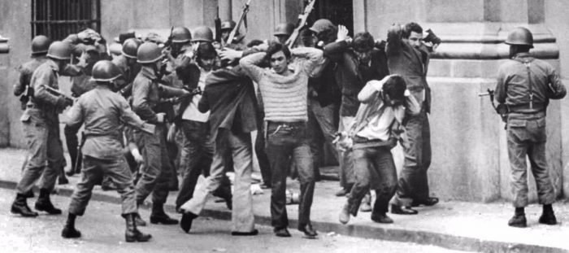

{.post-cover}

En septiembre pasado se cumplieron 50 años del golpe militar. En este contexto de reflexión, analizar los efectos que el golpe tuvo sobre el movimiento sindical es clave para entender no sólo la dictadura como tal, sino su herencia política-económica e institucional.

Como se sabe, el golpe de Estado tuvo consecuencias desastrosas para el movimiento sindical chileno. Por un lado, la represión a militantes de izquierda y a dirigentes sindicales destruyó los vínculos entre partidos y sindicatos que por décadas habían sido la columna vertebral del sindicalismo nacional. Por otro lado, la imposición de leyes represivas y abiertamente antisindicales significó la construcción de un sistema de relaciones laborales diseñado para socavar el poder sindical.

Estas leyes fueron la base de lo que se conoció como el Plan Laboral de 1979. El Plan Laboral consolidó los cambios instalados a través de los Decretos 2.756 sobre organización sindical y 2.758 sobre negociación colectiva y huelga. Entre otras cosas, estos decretos descentralizaron la negociación colectiva, restringiéndola únicamente al ámbito de la empresa (la negociación colectiva por rama de actividad económica quedó prohibida).

  <a class="btn btn-sm btn-primary" href="https://www.elmostrador.cl/noticias/opinion/columnas/2023/12/24/dictadura-militar-y-sindicalismo-la-deuda-pendiente-del-plan-laboral-de-1979-el-mes-pasado-se-cumpl/" target="_blank" rel="noopener">Seguir leyendo</a>

## Etiquetas
Movimiento Sindical, Sindicalismo, Dictadura Militar.
