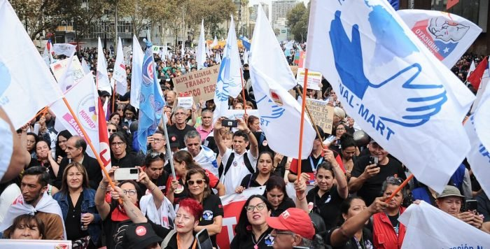

{.post-cover}

El pasado 11 de abril, miles de personas se sumaron al paro nacional activo, convocado por la Central Unitaria de Trabajadores y Trabajadoras (CUT). Las estimaciones sobre el tamaño de este tipo de convocatorias están siempre sujetas a discusión (mientras que algunos noticiarios estimaron en 15 mil el total de asistentes a la marcha de Santiago, la CUT sostiene que se sumaron 30 mil personas en la capital y cerca de 100 mil en todo Chile). Más allá de esto, lo que sí está claro es que la cantidad de personas que se movilizó ese día superó, con creces, incluso las expectativas más optimistas.

La masiva convocatoria sugiere que aún existen demandas que movilizan, al menos, a los sectores más organizados de la sociedad chilena. Esto es algo no menor, considerando el declive de las movilizaciones sociales luego de la pandemia y, especialmente, luego del plebiscito del 4 de septiembre de 2022. Más aún, un aspecto que debería ser mirado con mayor atención es que este incipiente proceso de movilización haya sido impulsado por el movimiento sindical. No es novedad que, en Chile, los sindicatos son débiles y que, salvo contadas excepciones, su capacidad de movilización es más bien baja.

En virtud de este problema, en décadas pasadas parte de la dirigencia de la CUT fue muy renuente a emprender movilizaciones y acciones de masa que, desde su perspectiva, solo podían dar cuenta de la debilidad del movimiento sindical. Sin embargo, y como mostré en otra columna, desde la década pasada, se ha observado una transformación importante dentro del movimiento sindical chileno. Esta transformación se expresa en el hecho de que, a pesar de su condición de debilidad, tanto los sindicatos de base como las organizaciones de nivel superior han reconocido la importancia que tiene la movilización colectiva como herramienta para defender los intereses sociopolíticos de las personas trabajadoras –es decir, los intereses que van más allá de sus legítimas demandas salariales “de nivel de empresa”–.

  <a class="btn btn-sm btn-primary" href="https://www.elmostrador.cl/noticias/opinion/columnas/2024/05/17/el-movimiento-sindical-y-sus-intentos-por-articular-demandas-y-proyectos-de-cambio-social/" target="_blank" rel="noopener">Seguir leyendo</a>

## Etiquetas
Movimiento Sindical, Cambio Social, Sindicalismo
