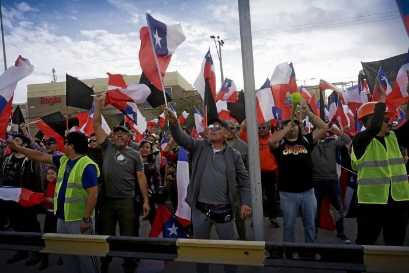

{.post-cover}

El año 2024 cerró con un debate político centrado casi exclusivamente en la reforma previsional. Más allá de no satisfacer a amplios sectores de la izquierda y centroizquierda, el aparente acuerdo alcanzado en torno a dicha reforma abre la posibilidad de nuevas discusiones en la agenda laboral del Gobierno.

Así, asumiendo que la reforma previsional pasa las instancias legislativas respectivas, es muy probable que la discusión laboral del último año de gobierno de Gabriel Boric gire en torno al proyecto de negociación colectiva por rama de actividad económica (“negociación multinivel”), anunciado varias veces durante 2024. 

Esto hace suponer que este 2025 traerá consigo varios desafíos para el movimiento sindical. Estos desafíos están asociados tanto al contexto político-social del país como a dinámicas internas del propio sindicalismo nacional. 

  <a class="btn btn-sm btn-primary" href="https://www.elmostrador.cl/noticias/opinion/columnas/2025/02/13/perspectivas-y-desafios-del-movimiento-sindical-para-el-ultimo-ano-de-gobierno-de-boric/" target="_blank" rel="noopener">Seguir leyendo</a>

## Etiquetas
Movimiento Sindical, Boric, Gobierno.
